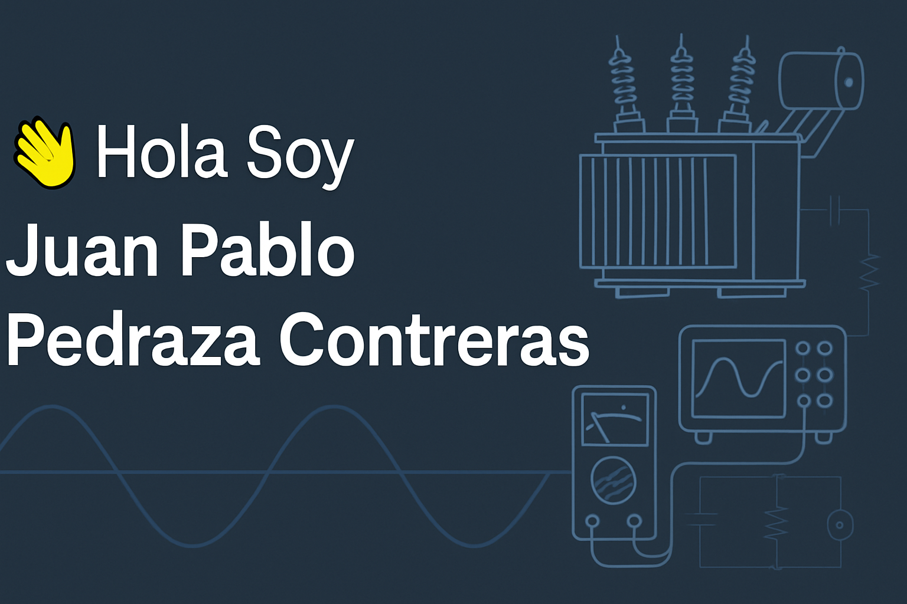

<!-- Banner personalizado -->

  

# Mi perfil 

🎓 Estudiante de **Ingeniería Electrónica** en la Universidad Santo Tomás  
🏢 Actualmente trabajando en **ABC Transformadores e Ingeniería**  
⚡ Apasionado por los microcontroladores, la electrónica aplicada, la simulación y el desarrollo técnico.

---

## 🛠️ Tecnologías y herramientas

---

### 🔬 Experiencia práctica

Manejo de **instrumentación profesional de pruebas eléctricas**, enfocada en diagnóstico y mantenimiento de **transformadores de potencia y distribución**. Familiaridad con equipos de medición avanzados y análisis de parámetros eléctricos en campo.

---

## 📌 Proyectos Destacados

| Proyecto | Descripción | Tecnologías |
|----------|-------------|-------------|
| `Transformadores Test Lab` | Sistema de monitoreo para pruebas eléctricas |    |
| `Simulación AM` | Análisis de señales AM con MATLAB y FFT |  |
| `Simulador de Fallas` | Proyecto para entrenar personal técnico con fallas simuladas |   |

---

## 📈 Estadísticas en GitHub

---

## 🔄 Actividad reciente

---

## 📫 Contacto

- 📧 Correo institucional: [juanpedrazac@usantotomas.edu.co](mailto:juanpedrazac@usantotomas.edu.co)
- 📨 También puedes escribirme por aquí en GitHub si es algo técnico o relacionado con proyectos

---

> "Construyo desde lo más simple hasta lo más complejo. La electrónica no solo se piensa, se vive."
